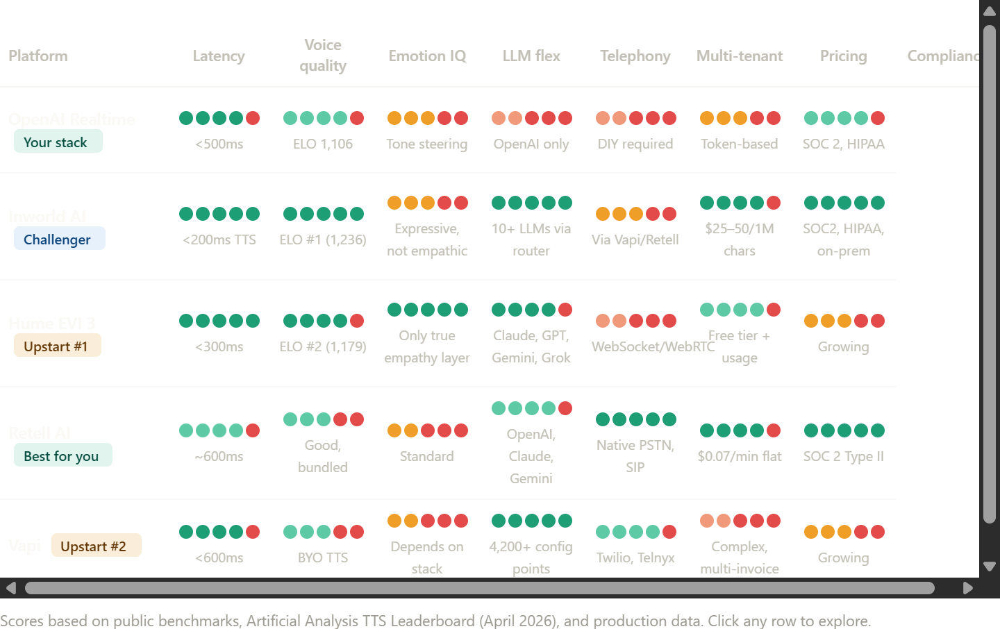
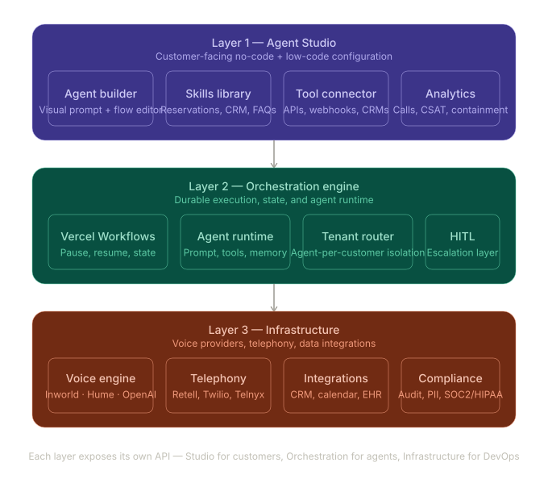

## Strategic Machines

Basic app architecture for the Voice Agents platform:

> Context Engineering
> Tools (including visual)
> Data is the Code


### Features Include
* Data driven AI architecture, where a set of tool descriptors retrieved from the db are used to direct the model for local or remote api calls
* Elegant interactions with the the LIVE Voice Agent, fully instructed through JSON Prompts on the scope, purpose and outcomes of a session
* Speciality tools for retrieving and querying website content, or celebrating a result, or finding and opening a web site
* Visual tool which provides the voice agent with capabilities to render forms, videos, images and documents based on the user request. These forms include a credit card payments for processing Stripe payments, and recording card data in a PCI DSS compliant manner (Payment Card Industry Data Security Standard) 

See the components/visuals/registry.tsx for the setup of a new component that can be rendered by the tool show_component 

* Tenant Custom tools providing the use case specific tools and functions required by the tenant for activating and enabling their Voice Agent. The Actions collection on Mongo (http descriptors) holds the http tool descriptors, which defines the api calls to the tenant's applications, such as a Booking Engine application (in the case of a tenant Hotel property), buying product (in case of a products company), scheduling appointments (in case of a professional services firm) or providing infomration about events. 

HTTP tool descriptors have declarative UI instructions.
Runtime behavior (from /api/tools/execute):
- Templating context is { args, response, status, secrets }.
- Strings in url/headers/body/ui are templated via `tpl()` (supports filters).
- Success = http.okField exists (truthy) in response OR HTTP 2xx when okField omitted.
- Then apply ui.onSuccess or ui.onError; payload is templated again with the same ctx.
- `pruneEmpty: true` strips "", null, {}, [] before sending.

### MIGRATION GUIDELINES
https://developers.openai.com/api/docs/guides/realtime#beta-to-ga-migration

### STRATEGY

Now I have everything I need. Let me write the full report.Good — I have everything I need. Let me write this full strategic report now.

---

# Strategic Voice Platform Report for Strategic Machines

## Your platform, diagnosed first

I looked at strategicmachines.ai. What you've built is a services-led, enterprise delivery platform — beautifully positioned for financial services, insurance, hospitality, government — with OpenAI Realtime at the core, strong security messaging, and the right outcome language (cost-to-serve, NPS, containment). The gap you're sensing is real: it's a professional services firm wrapping voice AI, not yet a self-service platform that scales without engineering hours per customer. That's the tension, and your instinct to solve it is right. Let's go.

---

## Part 1 — The voice intelligence landscape: who's actually leading in 2026

The market has moved fast. A year ago there was essentially one viable speech-to-speech API. Today there are five serious options, and the field keeps expanding — Google launched Gemini Flash Live in March 2026, xAI shipped the Grok Voice Agent API in December 2025, and Hume released EVI 3. Here's how the major players stack up across the criteria that matter for your business.

The evaluation criteria I used: latency (conversational feel), voice quality (ELO score on blind listening tests), emotional intelligence (tone/affect awareness), LLM flexibility (can you swap models), telephony readiness (native PSTN/SIP vs. DIY), multi-tenancy/platform suitability (build a SaaS on top), pricing model, and compliance posture (HIPAA, SOC 2).Here's the strategic read on each:



**OpenAI Realtime — still excellent, but no longer alone.** It remains the gold standard for reasoning quality and ecosystem integration, and its native multimodal pipeline keeps audio in a single model rather than handing off between STT, LLM, and TTS components, which reduces latency and preserves tonal nuance. The weakness for your use case is that it's a raw API — you supply telephony, you supply TTS configuration, you do all the orchestration yourself. It is not a platform that scales to thousands of tenants. Solid to keep as a model option, but dangerous to treat as your entire infrastructure.

**Inworld AI — the voice quality winner.** Inworld's TTS-1.5 Max holds the number one position on the Artificial Analysis TTS leaderboard with an ELO of 1,236, with three of the top five positions occupied by Inworld models. A team building on Inworld makes one API integration and gets TTS, STT, LLM access, and real-time orchestration — the equivalent of five separate vendors collapsed into one. They were founded by the API.ai team that Google acquired and turned into Dialogflow, so they know this space cold. Clients now include Comcast/NBCUniversal, Google, NVIDIA, Meta, Disney, and Xbox. The gap is telephony — they're a voice infrastructure layer, not a call platform. You'd pair them with Retell or Twilio for PSTN.

**Hume EVI 3 — the emotional intelligence wildcard.** EVI 3 responds in under 300 milliseconds and is the only voice AI that genuinely understands emotional expression — reading voice, tone, and context simultaneously. It integrates with Claude 4, Gemini 2.5, Grok, and other LLMs, and offers hyperrealistic voice cloning from under 30 seconds of recording. For your hospitality, healthcare, and coaching/training verticals, Hume is a legitimate differentiator — an agent that can hear frustration in a caller's voice and respond more gently is a meaningfully better product. Not mature enough for heavy enterprise compliance yet, but watch it closely.

**Retell AI — the strongest platform layer for your business model.** For production-ready businesses needing both no-code and API access, Retell leads at $0.07/min with approximately 600ms latency and SOC 2 Type II compliance. Critically for you: it has native multi-tenant architecture, phone number provisioning, SIP trunk support, and pre-built templates. It connects to any telephony provider — Twilio, Vonage, Telnyx, Avaya, or your own carrier — via SIP trunk, so customers keep their existing numbers. It is the most viable foundation for a platform you sell to businesses at scale.

**Vapi — the developer's sandbox.** Vapi offers maximum API flexibility and the ability to bring your own stack at every layer. It supports sub-600ms latency with WebRTC audio and is compatible with OpenAI, Claude, Deepgram, Whisper, ElevenLabs, PlayHT, Twilio, Telnyx, and custom API connections. The pricing model is the problem — multi-part pricing means you could receive up to five invoices to run a voice agent, which makes reselling and margin management a nightmare. Good for building one-off custom agents, bad for a multi-tenant SaaS.

**My recommendation for your stack:** Run Retell AI as your telephony/orchestration layer. Use Inworld for voice quality where brand voice matters (hospitality, financial services). Keep OpenAI Realtime as a selectable LLM option. Offer Hume EVI 3 as a premium tier for emotionally sensitive use cases like coaching, healthcare intake, and high-stakes customer service.

---

## Part 2 — How to redesign Strategic Machines as a scalable platform

You looked at Vercel Workflows for a reason — the problem you're solving is state management across multi-step, long-running agent workflows that need to survive deployments, handle API failures, and be configured by non-engineers. That is exactly the right instinct. Here's the full architecture.

### The core design philosophy

Your platform needs to do three things at once: be a no-code studio for business owners who want to drag prompts into boxes, a developer API for engineering teams that want full control, and a durable execution engine that manages the real complexity underneath. The mistake most platforms make is optimizing for one of those three and neglecting the others.

### The three-layer architecture



### Layer 1 — The Agent Studio (what customers see)

This is where you win or lose customers. The studio has to feel like building a Notion page, not configuring a phone system. The key insight is that configuring a voice agent has five conceptual parts that customers understand intuitively:

**Identity.** Who is this agent? Name, voice, persona, language. Voice selection should play a preview clip inline. This takes 2 minutes.

**Behavior.** What does the agent do and how does it handle situations? This is prompt engineering made visual. You give customers a structured prompt template with fill-in sections — opening greeting, primary goal, handling objections, fallback phrases, escalation triggers. Advanced users get a raw prompt editor. Think of it like Webflow: beginners use components, pros go to code view.

**Skills.** Pre-built capabilities the agent can use: make a reservation (connects to your calendar API), look up an order (connects to your CRM), send a confirmation text, transfer to a human. Skills are composable and parameterized — the customer fills in which calendar, which CRM, what confirmation message.

**Tools and APIs.** For technical customers, a JSON-schema-driven tool builder where they define external API calls. The platform handles auth (OAuth, API key vault) and maps function signatures. Think of this as the OpenAI function calling layer, but exposed visually.

**Testing.** An inline voice simulator where the customer can call their own agent from the browser before going live. This is the single highest-leverage trust builder you can build. Customers who've heard their own agent respond perfectly to a hard question will deploy confidently.

### Layer 2 — The Orchestration Engine (where Vercel Workflows earns its place)

This is the answer to your original question. The problem with a naive voice agent is that it's stateless — each call starts from scratch. Real business use cases need:

Conversations that span multiple calls (a customer calls about a reservation, then calls back to modify it — the agent remembers). Long-running workflows triggered by voice that involve waiting for external systems (agent books a restaurant, waits for confirmation webhook from the restaurant's system, then sends an SMS). Human-in-the-loop steps where the agent collects information and then routes to a human expert. Scheduled outbound calls with business logic attached.

Vercel Workflows solves all of this with `'use workflow'` and `'use step'` directives. A reservation workflow looks something like:

```typescript
export async function reservationWorkflow(callerId: string, request: ReservationRequest) {
  'use workflow';

  const availability = await checkCalendar(request); // step: call external API

  if (!availability.hasSlots) {
    await notifyCustomer(callerId, 'no-slots');
    return;
  }

  const booking = await createBooking(availability.bestSlot); // step: create booking

  await sleep('2 hours'); // pause — wait for confirmation window

  const confirmed = await checkBookingStatus(booking.id); // step: verify

  if (!confirmed) {
    await escalateToHuman(callerId, booking); // step: hand off
  }

  await sendConfirmationSMS(callerId, booking); // step: notify
}
```

The workflow pauses for two hours, survives server restarts, resumes exactly where it left off, and every step is logged in the Vercel dashboard. You could not build this reliability on a raw serverless function.

The tenant router layer ensures each customer's agents run in isolation — their data never touches another tenant's context, their rate limits are tracked separately, and their agent configurations are versioned so a bad prompt deploy doesn't affect running calls.

### Layer 3 — Infrastructure as a provider marketplace

Rather than locking customers to one voice engine, your platform should expose a provider selection within the Studio. Small businesses default to Retell + Inworld (lowest friction, best quality/price). Enterprise customers with HIPAA requirements default to Inworld on-prem + Retell with BYOC (bring your own carrier). Emotionally demanding use cases (coaching, healthcare, mental wellness) can select Hume EVI 3 as the voice layer.

This is a strategic moat: you're not competing on voice quality (you can always switch your provider layer), you're competing on the studio experience, the workflow durability, and the industry-specific skills library.

### The open source vs. commercial decision

Here's how I'd stack the technology choices:

**Use Vercel Workflows** for durable agent orchestration. The cost model (usage-based, pay per event/data) is perfectly aligned with your per-customer pricing. The observability built in (every step, sleep, and error logged automatically) gives you the audit trails your enterprise customers require. Vercel also gives you edge deployment globally, which matters for latency.

**Use Retell AI** as your telephony layer. They have the best PSTN/SIP integration, flat pricing, SOC 2 Type II, and a developer API that lets you configure agents programmatically (essential for your multi-tenant model). Their managed infrastructure handles concurrent call scaling — you don't manage a Twilio account per customer.

**Use Inworld AI** as your primary TTS layer. #1 voice quality at competitive pricing, sub-200ms generation, on-premise option for regulated industries. Switch from OpenAI TTS here first — it's the highest-leverage quality upgrade available.

**Keep OpenAI** as one LLM option in your router, alongside Claude and Gemini. Never bet the platform on a single model provider. If OpenAI's pricing moves or quality regresses, you want to route around it without customer-facing disruption.

**Build the Studio on Next.js / Vercel.** Your entire hosting, CI/CD, and edge infrastructure stays in one ecosystem. The Studio is a Next.js app deployed to Vercel, calling Vercel Workflows, storing agent configs in a Postgres database (Vercel Postgres or Neon), with blob storage for voice samples and call recordings.

**Use tRPC or an OpenAPI layer** to expose everything as a developer API. Every action a customer can take in the Studio should also be possible via API — this unlocks agency/reseller partners who want to white-label your platform and manage agents programmatically.

### The configuration management problem specifically

The hardest UX problem you mentioned — customers configuring and deploying agents in a manageable way — comes down to three things:

First, progressive disclosure. Don't show a customer the full complexity of prompt engineering on screen one. Start with five questions: what industry, what's the agent's name, what's the primary goal, which calendar/CRM do you use, what language. From those five answers, generate a complete agent configuration that works out of the box. Advanced settings are one click deeper.

Second, template marketplace. Ship 12 industry-specific agent templates on day one: restaurant reservation agent, medical appointment scheduler, real estate inquiry agent, hotel concierge, insurance FNOL intake, etc. Each template is a fully configured starting point — customers fork a template and customize rather than building from scratch. This is how Squarespace beat building websites from scratch.

Third, the test-before-deploy gate. Make it physically impossible to deploy an untested agent. The platform requires at least one test call before enabling live traffic. This prevents bad configurations from going live and gives customers the confidence that the thing they're deploying actually works.

### Scaling to thousands of agents

Vercel manages the infrastructure for workflow execution, so the scaling problem is largely solved at the orchestration layer. What you need to architect carefully is:

Agent configuration versioning — every change to a prompt, skill, or tool is a new version, with rollback capability and A/B testing (route 10% of calls to the new version).

Per-tenant usage metering — each customer gets their own usage dashboard showing minutes used, calls completed, containment rate, and cost. This is your billing foundation.

Agent health monitoring — track per-agent metrics: average handle time, containment rate, escalation rate, CSAT if you connect to a post-call survey. Surface alerts when an agent's performance degrades (often a sign that a connected API is failing or a prompt needs tuning).

Concurrency management — Retell handles call concurrency, but your platform needs to set per-customer concurrency limits based on their plan tier and alert when they're approaching the ceiling.

### The product roadmap I'd recommend

Launching this properly is a 3-phase effort:

In the first phase (months 1-3), migrate from pure professional services to a platform that at least delivers customer-configurable prompts and skills via a dashboard, with Vercel Workflows underneath for durable execution and Retell as the telephony layer. Keep OpenAI but add Inworld as the voice option. Ship the test-before-deploy simulator. This unlocks repeatability — your engineers configure the integration layer once per customer type, customers iterate on prompts themselves.

In the second phase (months 4-6), build the template marketplace and the tool connector (the visual API builder). Add Hume EVI 3 as a premium voice option. Open the developer API so technical customers can manage their agents programmatically. Add the analytics dashboard. At this point you have a genuine SaaS product, not just a service.

In the third phase (months 7-12), launch a reseller/white-label program. Other agencies deploy your platform under their brand. Add enterprise features: SSO, role-based access, multi-user workspaces, on-premise voice options, custom compliance reporting. Expand the skills library to cover 30+ vertical use cases.

### The honest assessment of where you are

Looking at strategicmachines.ai right now, you're selling enterprise voice AI as a service — and you're doing it well, with the right outcomes language and solid industry coverage. Your current stack uses OpenAI Realtime for low-latency voice, cloud-native architecture, and ISO/SSO controls. What you don't yet have is a self-service layer, which means every new customer requires engineering hours and every customization requires your team.

The path forward is: keep the enterprise services motion (it's your current revenue), while building the platform layer underneath it. Every enterprise customer you serve today becomes a template for an industry vertical in your marketplace tomorrow. Your competitive advantage isn't the voice API — those are commoditizing fast. It's the industry knowledge baked into your agent templates, the workflow patterns you've refined for reservations and claims and concierge, and the trust your enterprise customers have in your security posture.

That's what nobody can replicate in 6 months. Build the platform around those assets, put Vercel Workflows underneath for durability, Retell for telephony, Inworld for voice quality, and you'll have something that genuinely scales to thousands of clever voice agents for businesses large and small.
