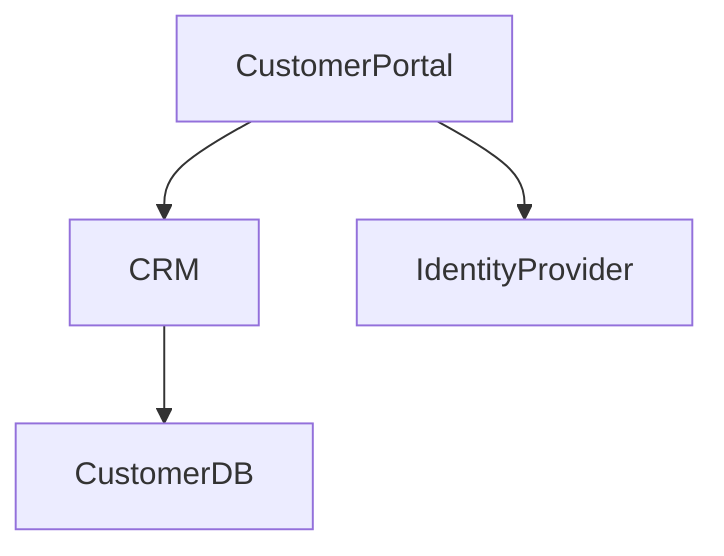

`````mdx id="ent-ai-prototype-build"
---
title: Enterprise AI Refactor Platform - Prototype Build Guide
description: Step-by-step instructions for building a prototype enterprise intelligence and refactor platform using Next.js, Vercel, Supabase, Neo4j Aura, and OpenAI.
---

# Enterprise AI Refactor Platform

# Prototype Build Guide

This document outlines the fastest, simplest, and most executable path to building a working prototype of an:

# Enterprise Refactoring Intelligence Platform

The goal is NOT:
- another chatbot
- another enterprise search engine
- another RAG assistant

The goal is:
# an AI-native enterprise reasoning system

The system should help users:
- understand enterprise architecture
- analyze dependencies
- identify duplication
- rationalize systems
- redesign processes
- generate target-state architectures
- produce migration roadmaps
- create architecture decision records
- refactor enterprise applications and operating models

---

# Core Strategy

## IMPORTANT

Do NOT start with:
- AWS complexity
- Kubernetes
- full self-hosted models
- distributed inference clusters
- enterprise-grade ingestion pipelines
- full fine-tuning infrastructure

You need:
# a working enterprise reasoning cockpit first

The fastest successful path is:

```txt
Vercel
+ Supabase
+ Neo4j AuraDB
+ OpenAI
+ Next.js
```

This stack minimizes infrastructure complexity while maximizing iteration speed.

---

# Recommended Prototype Stack

| Layer | Technology |
|---|---|
| frontend | Next.js |
| UI | Shadcn/UI + Tailwind |
| hosting | Vercel |
| auth | Supabase Auth |
| relational database | Supabase Postgres |
| object storage | Supabase Storage |
| graph database | Neo4j AuraDB |
| LLM reasoning | OpenAI |
| realtime later | Supabase Realtime |
| workflow/jobs later | Temporal or BullMQ |

---

# Why This Stack

## Vercel

Best for:
- rapid deployment
- Next.js integration
- edge APIs
- AI streaming
- developer velocity

You should optimize for:
# speed of iteration

not infrastructure purity.

---

# Why Supabase

Supabase gives:
- Postgres
- authentication
- storage
- realtime
- APIs
- row-level security

In one platform.

You avoid:
- IAM complexity
- separate storage services
- auth infrastructure
- custom API layers

Perfect for prototype phase.

---

# Why Neo4j AuraDB

Your platform fundamentally depends on:
# relationships

Not documents.

Neo4j excels at:
- dependency mapping
- impact analysis
- graph traversal
- enterprise relationships
- lineage analysis

AuraDB gives:
- fully managed cloud graph database
- zero infrastructure management
- immediate usability

---

# Why OpenAI First

Do NOT self-host Qwen or Llama initially.

Use OpenAI first because:
- highest reasoning quality
- fastest time-to-value
- no GPU ops
- no inference management
- excellent structured output generation

Your first challenge is:
# proving enterprise reasoning value

NOT:
# operating model infrastructure

---

# Future Transition Plan

Later you can evolve to:

```txt
Qwen
+ QLoRA
+ vLLM
+ AWS GPU hosting
```

But only AFTER:
- the semantic model works
- the graph works
- the workbench works
- the workflows prove value

---

# Prototype Scope

# CRITICAL RULE

Do NOT attempt the whole enterprise.

Start with:
# ONE DOMAIN

Example domains:
- customer onboarding
- order-to-cash
- finance close
- claims processing
- identity management
- product lifecycle
- application portfolio

---

# Recommended MVP Domain

## Customer Onboarding

This is ideal because it contains:
- multiple systems
- integrations
- data entities
- policies
- workflows
- ownership boundaries
- customer data
- operational pain points

Perfect for proving enterprise reasoning.

---

# Initial Dataset Size

Keep it intentionally small.

Load:

```txt
5-10 applications
2-3 process flows
1 ERD
5-10 policies
5-10 integrations
key owners
known pain points
```

That is enough to prove the architecture.

---

# Build Sequence

# PHASE 1 — FOUNDATION SETUP

# Step 1 — Create Next.js App

```bash
npx create-next-app@latest enterprise-refactor-ai
```

Choose:

```txt
TypeScript: yes
Tailwind: yes
App Router: yes
src directory: yes
```

Then:

```bash
cd enterprise-refactor-ai
```

---

# Step 2 — Install Shadcn/UI

Initialize:

```bash
npx shadcn@latest init
```

Add core components:

```bash
npx shadcn@latest add \
button \
card \
textarea \
input \
tabs \
table \
badge \
dialog \
scroll-area \
sheet \
dropdown-menu \
separator
```

---

# Step 3 — Install Core Packages

## AI

```bash
npm install ai @ai-sdk/openai openai
```

---

## Databases

```bash
npm install @supabase/supabase-js
npm install neo4j-driver
```

---

## Validation

```bash
npm install zod
```

---

# Step 4 — Create Service Layer

Create:

```txt
/src/services/openai.ts
/src/services/supabase.ts
/src/services/neo4j.ts
/src/services/enterprise-tools.ts
```

This keeps the architecture modular from the beginning.

---

# PHASE 2 — CLOUD SERVICES

# Step 5 — Create Supabase Project

Create:
# enterprise-refactor-ai

Enable:
- auth
- storage
- Postgres

---

# Recommended Supabase Tables

## organizations

```txt
id
name
created_at
```

---

## users

```txt
id
organization_id
role
email
```

---

## artifacts

```txt
id
organization_id
type
name
source_file
version
created_at
```

---

## artifact_versions

```txt
id
artifact_id
version
content
parsed_output
created_at
```

---

## analysis_runs

```txt
id
organization_id
prompt
result
created_at
```

---

## generated_outputs

```txt
id
analysis_run_id
type
content
created_at
```

---

# Step 6 — Create Neo4j AuraDB

Create free AuraDB instance.

Use AuraDB Free initially.

---

# Recommended Graph Node Types

```txt
Application
Capability
Process
ProcessStep
DataEntity
Attribute
Policy
Control
Risk
API
Integration
Owner
Team
Initiative
Decision
```

---

# Recommended Relationships

```txt
SUPPORTS
USES
STORES
CONNECTS_TO
GOVERNS
MITIGATES
DEPENDS_ON
OWNS
CHANGES
AFFECTS
```

---

# PHASE 3 — BUILD THE ENTERPRISE MODEL

# Step 7 — Define Enterprise Ontology

This is one of the most important steps.

Your ontology defines:
# how the enterprise thinks

---

# Example Ontology

## Applications

```txt
Application
  supports Capability
  stores DataEntity
  owned_by Team
  governed_by Policy
```

---

## Processes

```txt
Process
  uses Application
  contains ProcessStep
  constrained_by Policy
```

---

## Policies

```txt
Policy
  governs DataEntity
  constrains Process
  mitigates Risk
```

---

# IMPORTANT

Do NOT overcomplicate the ontology initially.

Keep:
- object types simple
- relationships understandable
- graph highly queryable

---

# PHASE 4 — MANUAL GRAPH SEEDING

# Step 8 — Manually Load Initial Enterprise Data

DO NOT automate ingestion yet.

This is a huge mistake most teams make.

Start manually.

Create:
- JSON
- CSV
- simple scripts

Example:

```json
{
  "application": "Customer Portal",
  "supports": [
    "Customer Onboarding",
    "Self-Service"
  ],
  "stores": [
    "Customer",
    "Account",
    "Address"
  ],
  "integrations": [
    "CRM API",
    "Identity Provider"
  ],
  "risks": [
    "PII exposure"
  ]
}
```

Then load into Neo4j.

---

# Why Manual Loading First

Manual loading forces you to:
- validate ontology
- validate graph structure
- validate reasoning quality
- validate relationship patterns

Before:
# wasting time on ingestion automation

---

# PHASE 5 — ENTERPRISE REFACTOR WORKBENCH

# Step 9 — Build the Main Workbench UI

Recommended layout:

```txt
------------------------------------------------
| Domain Selector | Chat | Generated Artifacts |
------------------------------------------------
| Graph Evidence / Dependency Explorer          |
------------------------------------------------
```

---

# Core Workbench Features

## Chat Input

Users ask:

```txt
What systems support customer onboarding?
```

```txt
What breaks if we retire Customer Portal?
```

```txt
Generate a target-state architecture.
```

---

## Artifact Output

The AI should generate:
- Markdown
- Mermaid diagrams
- ADRs
- migration plans
- impact analyses
- dependency tables
- target-state architectures

---

## Graph Evidence Panel

Show:
- source applications
- related systems
- impacted entities
- graph traversal evidence

This builds:
# trust

---

# PHASE 6 — THE MOST IMPORTANT PATTERN

# NEVER SEND RAW DOCUMENTS TO THE MODEL

Instead:

```txt
User Prompt
  ↓
Query Enterprise Graph
  ↓
Assemble Structured Context
  ↓
Send Structured JSON to LLM
  ↓
Generate Enterprise Artifact
  ↓
Persist Result
```

This is:
# enterprise semantic reasoning

NOT:
# naive RAG

---

# Example Structured Context

```json
{
  "domain": "Customer Onboarding",
  "applications": [
    {
      "name": "Customer Portal",
      "supports": [
        "Customer Onboarding",
        "Self-Service"
      ],
      "stores": [
        "Customer",
        "Account",
        "Address"
      ],
      "integrates_with": [
        "CRM API",
        "Identity Provider"
      ],
      "risks": [
        "PII exposure",
        "legacy authentication"
      ]
    }
  ],
  "policies": [
    {
      "name": "PII Handling Policy",
      "governs": [
        "Customer",
        "Address"
      ]
    }
  ]
}
```

Then ask:

```txt
Using only this enterprise context:
- generate impact analysis
- propose future-state architecture
- identify migration risks
- generate phased roadmap
```

---

# PHASE 7 — ENTERPRISE TOOLS

# Step 10 — Build Internal Tool APIs

Examples:

```txt
get_application(name)
get_capability_map(domain)
get_process_dependencies(process)
get_policy_constraints(entity)
get_impacted_entities(system)
generate_mermaid_diagram()
create_adr()
compare_current_vs_target_state()
```

The model becomes:
# tool-using enterprise intelligence

instead of:
# conversational AI

---

# PHASE 8 — ARTIFACT GENERATION

# The AI Should Produce Operational Assets

Examples:

- Mermaid diagrams
- ADRs
- migration roadmaps
- dependency maps
- target-state architectures
- ERD changes
- process redesigns
- risk matrices
- governance recommendations

This is:
# operational enterprise reasoning

---

# Mermaid Example

````md

`````

The ability to generate architecture diagrams dynamically is extremely powerful.

---

# PHASE 9 — FINE-TUNING (LATER)

# DO NOT START HERE

Start with prompting + graph + structured context first.

Only fine-tune after:

* ontology stabilizes
* outputs stabilize
* reasoning patterns stabilize

---

# Future Fine-Tuning Stack

```txt
Qwen3
+ QLoRA
+ Unsloth
+ Axolotl
+ PEFT
```

---

# What Fine-Tuning Should Teach

Teach:

* architecture reasoning
* migration planning
* ADR structure
* enterprise terminology
* policy analysis
* process redesign patterns
* preferred documentation formats

Do NOT teach:

* all enterprise facts

Those belong in:

# the graph

---

# PHASE 10 — FUTURE EVOLUTION

# When To Introduce AWS

ONLY after:

* prototype proves value
* graph scales
* enterprise adoption begins
* security requirements increase

Then move to:

* SageMaker
* Bedrock
* private VPCs
* enterprise SSO
* GPU hosting
* model serving clusters

---

# Future Evolution Path

```txt
Prototype
  ↓
Graph-Centered Intelligence
  ↓
Structured Enterprise Compiler
  ↓
Tool-Using AI
  ↓
Fine-Tuned Enterprise Architect
  ↓
Digital Twin of the Enterprise
```

---

# The Long-Term Vision

The ultimate product is:

# A Living Enterprise Intelligence System

The system understands:

* systems
* processes
* capabilities
* dependencies
* policies
* risks
* ownership
* transformation initiatives

Then AI can:

# simulate and refactor the enterprise

before changes are implemented.

---

# Final Strategic Insight

The real opportunity is NOT:

# enterprise chat

The opportunity is:

# enterprise reasoning

Most companies already possess the knowledge required to redesign themselves.

The problem is:

* fragmented systems
* disconnected artifacts
* stale documentation
* tribal knowledge
* siloed architecture repositories

Your platform converts:

# fragmented enterprise knowledge

into:

# a living semantic operating model

that AI can reason over.

---

# Final Recommended Stack

```txt
Frontend:
Next.js
Shadcn
Tailwind

Hosting:
Vercel

Database:
Supabase

Graph:
Neo4j AuraDB

LLM:
OpenAI

Future Model:
Qwen3 + QLoRA

Future Hosting:
AWS GPU Infrastructure
```

---

# Final Recommendation

Focus on:

# proving enterprise reasoning quality

NOT:

# infrastructure sophistication

Your first milestone is NOT:

> “We trained a custom model.”

Your first milestone is:

# “The AI produced a credible enterprise refactor recommendation that architects found useful.”

That is the breakthrough moment.

```
```
